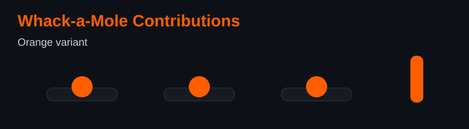

# Pontapalli Rohith (Rohith-Shimori)

[Portfolio](https://rohith-shimori.github.io/portfolio/) • [LinkedIn](https://in.linkedin.com/in/pontapalli-rohith) • [Email](mailto:pontapallirohith@gmail.com)

## TL;DR
Full-stack AI engineer and 3rd-year CSE student at MVGR building production-ready web and AI systems with React, Python, Supabase, and Postgres.

## Featured Projects
### 1) NCC Digital Training Platform
React • Supabase • Postgres • PWA  
Digitizes NCC operations with syllabus tracking, drill exam simulation, wing analytics, and offline-first workflows.  
[Live Demo](https://nccdigi.vercel.app) • [Source](https://github.com/Rohith-Shimori)

### 2) TruthLens
Python • Google ADK • Hugging Face • FastMCP  
Multimodal fact-verification and deepfake-analysis agent pipeline built for Kaggle × Google AI Agents Capstone.  
[Live Demo](https://huggingface.co/spaces/Rohith-Shimori/TruthLens-AI-Agent) • [Source](https://github.com/Rohith-Shimori)

## Skills
- **Languages:** Python, JavaScript, TypeScript, SQL
- **Frontend:** React, Vite, Tailwind CSS, PWA patterns
- **Backend & Data:** Supabase, PostgreSQL, REST APIs
- **AI/ML:** Agent orchestration, multimodal workflows, prompt/system design
- **Tools:** Git, GitHub Actions, Vercel, Docker

## Quick GitHub Stats

## Whack-a-Mole Preview

Variant links: [Red](output/whack-a-mole-red.svg) • [Black](output/whack-a-mole-black.svg)

## Education & Achievements
- B.Tech, Computer Science and Engineering, MVGR College of Engineering (GPA: 8.6)
- Kaggle × Google AI Agents Capstone contributor
- Credly verified badges: [View profile](https://www.credly.com/users/rohith-pontapalli)

## Contact
- Email: [pontapallirohith@gmail.com](mailto:pontapallirohith@gmail.com)
- LinkedIn: [pontapalli-rohith](https://in.linkedin.com/in/pontapalli-rohith)
- Portfolio: [rohith-shimori.github.io/portfolio](https://rohith-shimori.github.io/portfolio/)

*Engineered with AI pair programming.*
